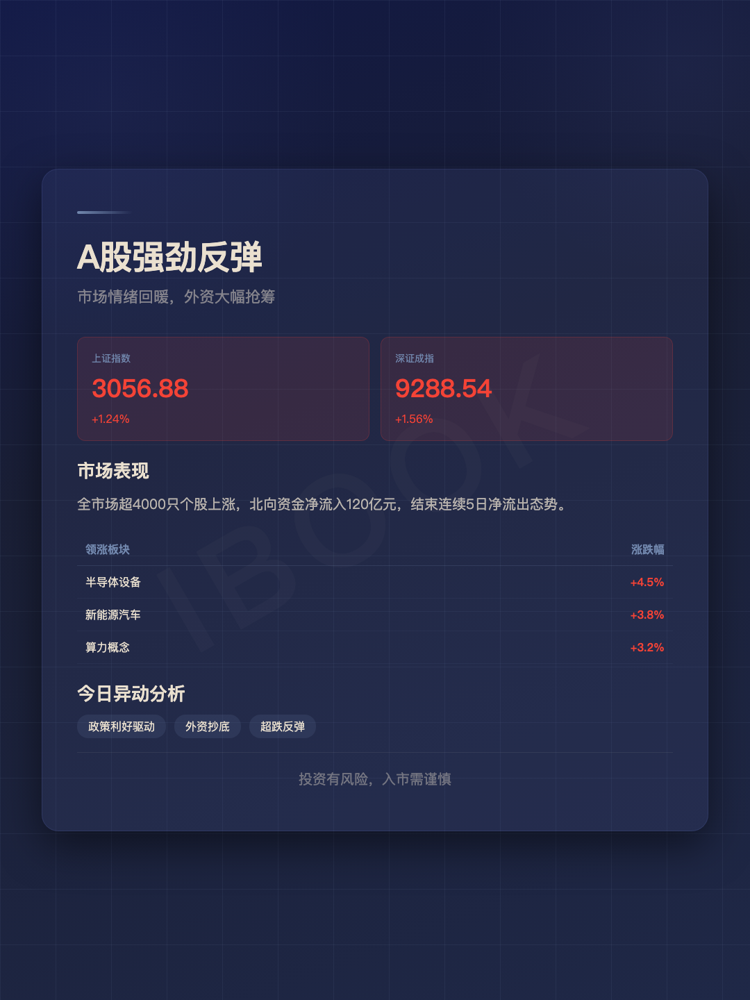
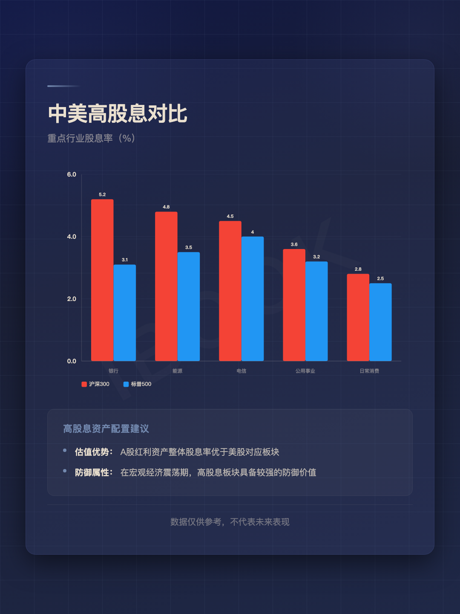

# ibook-skill

<p align="center">
  <strong>Ibook000 的个人 AI Agent Skill 仓库</strong><br>
  直接、工程、实战——让 AI 按我的方式工作
</p>

---

## 这是什么

这里存放我自己日常使用的 AI Agent **Skills**。每个 Skill 都是一个可加载的协作协议，让模型获得特定领域的知识、工作流和人格风格。

不是教程，不是文档站——是**拿来就用的工具包**。

---

## 技能列表

### 🏗️ ibook-builder

> 工程 Builder 操作系统 · 把想法做成能跑的系统

**解决什么问题：** 不想让 AI 只给概念建议？想要一个默认就考虑配置、日志、异常、部署的协作模式？

**核心风格：**
- 先给明确结论，再给实现路径
- 先做最小可运行闭环，再谈优化
- 能工具化就不停在 prompt
- 默认补充文件结构、接口、日志、部署要点

**激活方式：**
```
用 ibook 的方式做这个
按 ibook 的思路拆
切到 ibook 模式
别空谈，直接给我能跑的版本
```

**适用场景：** AI 应用开发、Python 后端、Agent/MCP/Skill 设计、自动化工具、交易系统、Web 后台、Linux 部署

[→ 查看 SKILL.md](./SKILL.md)

---

### 📈 jiaoyiyuan-tony

> 李法师Tony · 交易思维操作系统

**解决什么问题：** 交易中迷茫、频繁止损、守不住利润、被市场情绪左右？

**核心理念：**
- 技术只占 30%，资金管理和心态占 60%
- 交易就是越符合人性的越赚不到钱
- 趋势为王，小赔大赚，做大盈亏比
- 独立思考，远离噪音，不猜顶底

**激活方式：**
```
用 Tony 的交易思维分析一下
按李法师的思路看这个行情
Tony，我该不该止损
```

**适用场景：** 交易心态纠正、资金管理设计、趋势判断、风控体系搭建、财富认知升级

[→ 查看 SKILL.md](./skills/jiaoyiyuan-tony/SKILL.md)

---

### 🐦 tweet-card-generator

> 推特卡片生成器 · 一句话生成高密度数据卡片

**解决什么问题：** 想发数据驱动的推文但没有设计能力？需要快速把数据变成好看的信息图？

**能力：**
- 输入一个话题 → 自动搜索数据 → 生成推文 + PNG 数据卡片
- **12 种 SVG 图表**：柱状图、饼图、流程图、面积图、堆叠柱、环形图……
- **4 种布局**：Split / Stacked / Big Number / Timeline
- 米白底色 + `@IBO0OK` 水印，风格统一

**激活方式：**
```
生成一张关于 BTC ETF 流量的卡片
做个黄金持仓变化的图发推
tweet card for NVIDIA earnings
```

**适用场景：** 推特/社交媒体数据可视化、加密货币数据分析、快速制作信息图、自动推文配图

[→ 查看 SKILL.md](./skills/tweet-card-generator/SKILL.md) | [模板目录](./skills/tweet-card-generator/templates/)

---

### 🔧 ssh-skill

> 高性能 SSH 操作技能 · 守护进程长连接 + 批量并发

**解决什么问题：** SSH 连接慢、跳板机配置复杂、批量服务器操作效率低？

**核心能力：**
- 守护进程长连接，自动连接复用
- 跳板机/堡垒机支持
- 批量并发操作，服务器间直接传输
- 自动错误恢复，SFTP 文件传输

**激活方式：**
```
ssh 连到 192.168.1.100
批量检查这10台服务器的状态
通过跳板机部署到生产环境
```

**适用场景：** 服务器运维、批量部署、文件传输、隧道/端口转发、数据库内网访问

[→ 查看 SKILL.md](./skills/ssh-skill/SKILL.md)

---

### ⚙️ ioc-edit

> STM32CubeMX .ioc 编辑技能 · 嵌入式配置自动化

**解决什么问题：** 手动编辑 .ioc 文件容易出错？需要批量修改引脚/外设配置？

**核心能力：**
- 添加/删除引脚配置
- 配置外设（I2C/USART/TIM/ADC/GPIO/SPI/DMA）
- 修改时钟树配置
- 使能/禁用中断（NVIC）

**激活方式：**
```
在 ioc 文件里添加 I2C1 引脚
配置 USART1 为 115200 波特率
修改时钟树为 72MHz
```

**适用场景：** STM32 开发、CubeMX 配置、嵌入式外设配置、引脚映射

[→ 查看 SKILL.md](./skills/ioc-edit/SKILL.md)

---

### 🖼️ image-well

> 图片搜索引擎 · 12 个 API 并行搜索

**解决什么问题：** 需要免费高质量图片？想一次搜索多个图库？

**核心能力：**
- 12 个 API 并行搜索（Openverse、Pexels、Pixabay、Met Museum、NASA、Rijksmuseum、Wikimedia、Unsplash、Smithsonian、Europeana、Iconify、Pollinations AI）
- 4 个零 API Key 源开箱即用
- 许可证过滤（CC、公共领域、商业使用）
- 批量下载 + 元数据保存

**激活方式：**
```
搜索古代米诺斯壁画
找一些太空站的公共领域图片
下载 CC0 许可的图标
```

**适用场景：** 素材收集、设计资源、公共领域艺术、NASA 照片、图标搜索

[→ 查看 SKILL.md](./skills/image-well/SKILL.md)

---

### 📊 chart-visualization

> 数据可视化技能 · 26 种图表类型

**解决什么问题：** 数据想变成图表但不想写代码？需要快速生成可视化图片？

**核心能力：**
- 智能选择 26 种图表类型
- 自动提取数据参数
- 生成 PNG 图片输出
- 支持柱状图、折线图、饼图、散点图、热力图等

**激活方式：**
```
把这组数据做成柱状图
可视化这个 CSV 文件
生成一个饼图展示占比
```

**适用场景：** 数据分析、报告制作、快速可视化、自动化图表生成

[→ 查看 SKILL.md](./skills/chart-visualization/SKILL.md)

---


### 🦾 msp0-skill

> 面向电赛同学的 TI MSPM0 / 天猛星 G3507 AI 固件开发 Skill

让 AI Agent 能够理解并安全修改 MSPM0 项目的 `.syscfg`、引脚复用、时钟树和 DriverLib 应用代码，而不是直接乱改 SysConfig 生成文件。

**核心能力：**

- ⚡️ **配置和修改 SysConfig**：协助配置 GPIO、UART、PWM、Timer、ADC、I2C、SPI、DMA、时钟和中断。
- 🎯 **引脚与接线检查**：核对 `.syscfg`、生成头文件、开发板 PDF 和真实接线，规避 SWD、HFXT、BSL 及板卡版本差异。
- 🛡️ **保护生成流程**：坚持修改 `.syscfg` 源文件，再通过 CCS/SysConfig 重新生成，避免手改 `ti_msp_dl_config.c/h` 被覆盖。
- 🔍 **工程级排错**：检查 SDK、编译器、引脚冲突、I2C 上拉、供电、下载器和程序逻辑，并通过真实构建验证结果。
- 🛠 **示例与工具**：包含 LED、UART、PWM，以及自定义 MSPM0G3519 OLED UI 工程参考，并提供 `check_syscfg.py`、串口和 CCS DSS 调试脚本。

**主要面向：** 全国大学生电子设计竞赛（NUEDC）、智能车、机器人、课程设计以及使用 MSPM0G3507/G3519 的嵌入式开发者。

```text
/msp0-skill 检查当前项目的 SysConfig 和引脚配置是否正确，有无错误和踩坑
```

<p align="center">
  
</p>

<p align="center">
  
</p>

[→ 查看详细说明](./skills/msp0-skill/README.md) | [→ 查看 SKILL.md](./skills/msp0-skill/SKILL.md)

## 仓库结构

```
ibook-skill/
├── README.md                          ← 你正在看
├── SKILL.md                           ← ibook-builder 主 Skill
└── skills/
    ├── jiaoyiyuan-tony/
    │   └── SKILL.md                   ← Tony 交易员 Skill
    ├── tweet-card-generator/
    │   ├── SKILL.md                   ← 推特卡片生成器 Skill
    │   └── templates/
    │       ├── card-dense.html        ← 高密度多区块模板
    │       ├── card-template.html     ← 经典 4 布局模板
    │       └── chart-examples.html    ← 12 种 SVG 图表库
    ├── ssh-skill/
    │   ├── SKILL.md                   ← SSH 高性能操作 Skill
    │   ├── README.md                  ← 说明文档
    │   ├── scripts/                   ← 工具脚本
    │   └── examples/                  ← 使用示例
    ├── ioc-edit/
    │   ├── SKILL.md                   ← STM32 .ioc 编辑 Skill
    │   └── scripts/                   ← 编辑脚本
    ├── image-well/
    │   ├── SKILL.md                   ← 图片搜索 Skill
    │   ├── README.md                  ← 说明文档
    │   └── scripts/                   ← 搜索脚本
    ├── chart-visualization/
    │   ├── SKILL.md                   ← 图表可视化 Skill
    │   ├── scripts/                   ← 生成脚本
    │   └── references/                ← 参考资料
    └── msp0-skill/
        ├── SKILL.md                   ← MSPM0 Agent 规则
        ├── README.md                  ← 电赛向使用说明和效果截图
        ├── examples/                  ← LED、UART、PWM、完整工程示例
        ├── scripts/                   ← SysConfig 检查和调试工具
        └── references/                ← 引脚、SysConfig、DriverLib 知识库
```

---

## 安装方式

### 给 Hermes Agent 用户

在对话中直接说：

> 从 https://github.com/Ibook000/ibook-skill 安装 skill，把我需要的加进去

或者把对应 Skill 的完整目录复制到 `~/.hermes/skills/`。如果 Skill 包含 `references/`、`scripts/`、`assets/` 或 `examples/`，不要只复制 `SKILL.md`。

### 给其他 AI Agent 用户

把需要的 Skill 目录完整复制到 Agent 的 skills 目录。简单 Skill 可能只有一个 `SKILL.md`；像 `msp0-skill` 这样的工程型 Skill 还依赖同目录下的参考资料、示例和辅助脚本。

---

## 一句话

> 不是让 AI 学我说话，是让 AI 按我的方式做事。

---

<p align="center">
  <sub>Made by <a href="https://github.com/Ibook000">Ibook000</a> · 持续补充中</sub>
</p>

### 📸 技能生成内容展示

以下是 `xiaohongshu-finance` 技能直接生成的图片和排版效果（1080×1440）：

<p align="center">
  
  
  
</p>
