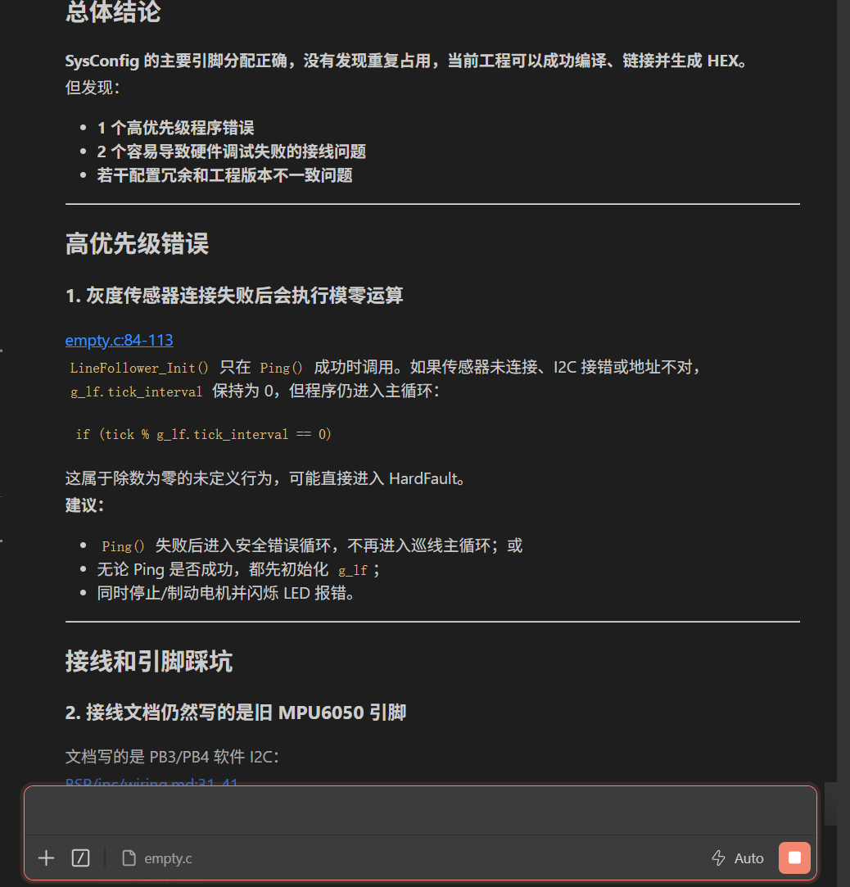
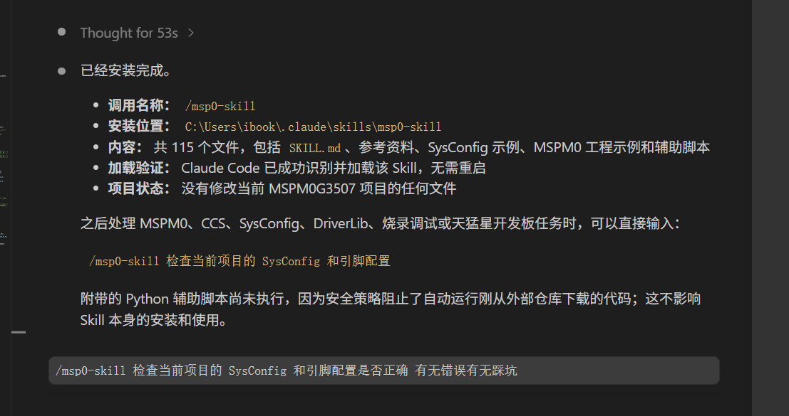

# TI MSPM0 Agent Skill

面向 **TI MSPM0 开发者与全国大学生电子设计竞赛（NUEDC / 电赛）同学**的 AI Agent Skill。

它让 Claude Code、Codex、Cursor 等 AI Agent 不只是“写几段 MSPM0 代码”，而是按照真实嵌入式项目的方式理解并操作：

- TI SysConfig
- DriverLib
- Code Composer Studio / CCS Theia
- Keil/uVision
- CMake + GCC + OpenOCD
- 引脚复用、时钟树、外设、中断与真实开发板接线

> 目标：让 AI 读取真实工程和板卡资料，安全修改 `.syscfg` 与 DriverLib 应用代码，核对引脚和时钟，重新生成并编译，再按供电、接线、通信和下载链路排查硬件问题。

主要路径是 **CCS / CCS Theia + SysConfig + DriverLib**；同时兼容 Keil/uVision 和 CMake/GCC/OpenOCD 工程。

## 一次完整任务会做什么

| 你提供 | Agent 执行 | 最终交付 |
|---|---|---|
| 芯片与开发板版本 | 识别工程、设备、封装和工具链 | 明确的工程与硬件基线 |
| 模块型号、供电和通信参数 | 修改 `.syscfg`，检查 PinMux、时钟和特殊引脚 | 修改文件、引脚表和外设参数 |
| 目标功能和期望行为 | 重新生成配置，读取真实宏和实例，再修改应用代码 | 可追踪的代码与配置变更 |
| 可用的编译、下载和硬件环境 | 生成、编译、链接，并按条件烧录或实测 | build/warning/烧录/板上验证分别报告 |

只有生成、编译、链接和目标固件产物都成功时才称为“构建通过”；硬件未实测时会明确标注验证边界。

## 适合谁

- 使用 MSPM0G3507、MSPM0G3519 等 MSPM0 芯片的同学
- 使用立创·天猛星 MSPM0G3507 开发板的同学
- 参加全国大学生电子设计竞赛、智能车、机器人或课程设计的同学
- 希望 AI 协助配置 GPIO、UART、PWM、Timer、ADC、I2C、SPI、DMA 的嵌入式开发者
- 经常被 SysConfig 生成文件、引脚冲突、时钟配置和下载调试问题卡住的人

## 核心能力

### 1. 让 AI 正确修改 SysConfig

Skill 会要求 Agent 把 `.syscfg` 当作引脚、时钟和外设配置的唯一真相源，而不是直接修改生成文件。

支持协助配置：

- GPIO 输入、输出、上下拉和中断
- UART 波特率、TX/RX 引脚
- PWM 频率、周期、占空比和通道
- Timer 周期和中断
- ADC 通道、参考电压和采样参数
- I2C / SPI 实例、引脚和通信参数
- DMA 通道和触发源
- 系统时钟、HFXT、SYSPLL、CPUCLK

### 2. 自动检查引脚与开发板踩坑

Agent 会同时核对：

1. `.syscfg` 中选择的 MCU 引脚；
2. SysConfig 生成头文件中的真实宏和复用功能；
3. 开发板 PDF、原理图或经过验证的引脚表；
4. 已占用的 SWD、晶振、BSL、板载 LED 等特殊资源。

内置天猛星 MSPM0G3507 V1.0.2 正面丝印与排针行列映射，并明确区分不同开发板和不同版本，避免把其他板子的 U21/U22、OLED、CH340 或板载外设连接错误套用过来。

### 3. 避免修改生成文件

Skill 明确禁止把以下文件当作长期修改入口：

- `Debug/ti_msp_dl_config.c`
- `Debug/ti_msp_dl_config.h`
- `device_linker.cmd`
- `.o`、`.out`、`.map`
- CCS/Keil 的其他生成目录

正确流程是修改 `.syscfg` 和应用源码，再通过 SysConfig/CCS 重新生成。

### 4. 检查并验证整个工程

Agent 可以协助：

- 识别 CCS、Keil、CMake/OpenOCD 工程结构
- 检查设备、封装、SDK、SysConfig 和编译器版本
- 检查生成宏、IRQ 名称和初始化函数
- 运行 SysConfig CLI 静态验证
- 重新编译并报告真实 warning/error
- 区分固件问题、下载器问题、接线问题和供电问题
- 使用 CCS DSS、DSLite、J-Link 或项目已有 OpenOCD 流程辅助调试

### 5. 提供可复用示例和工具

仓库包含：

- PB22 LED 闪烁
- UART0 阻塞发送
- PWM 呼吸灯
- MSPM0 空工程骨架
- 完整 MSPM0G3519 OLED UI 工程参考
- SysConfig 检查脚本
- SDK 示例索引脚本
- 串口监视工具
- CCS DSS 调试工具

## 实际使用效果

### 安装并加载 Skill



### 检查 SysConfig、引脚、接线和程序问题



## 使用示例

安装后可以直接让 Agent 执行：

```text
/msp0-skill 检查当前项目的 SysConfig 和引脚配置是否正确，有无错误和踩坑
```

也可以直接描述任务：

```text
帮我给天猛星 MSPM0G3507 配置 UART0，115200 8N1
```

```text
增加一个 20 kHz 的双通道电机 PWM，并检查引脚是否和 SWD、晶振冲突
```

```text
把编码器改成 GPIO 轮询，不使用中断，然后重新生成 SysConfig 并编译
```

```text
检查这个 I2C 传感器为什么没有 ACK，先核对供电、上拉、地址和引脚
```

```text
为电赛小车整理一份完整接线表，并以开发板 PDF 和生成头文件为准
```

## Claude Code 安装

复制完整目录，而不是只复制 `SKILL.md`：

```bash
git clone https://github.com/Ibook000/ibook-skill.git
cp -r ibook-skill/skills/msp0-skill ~/.claude/skills/
```

安装后调用：

```text
/msp0-skill
```

Skill 依赖同目录下的 `references/`、`examples/`、`assets/` 和 `scripts/`，因此需要保留完整目录结构。

## 目录结构

```text
msp0-skill/
├── SKILL.md                         # Agent 核心规则与执行协议
├── README.md                        # 本说明文档
├── assets/                          # SysConfig 片段和 README 图片
├── examples/                        # 可复用 MSPM0 示例
├── scripts/                         # 检查、索引、串口和调试脚本
└── references/                      # SysConfig、DriverLib 和硬件知识库
    ├── sysconfig_ccs_workflow.md
    ├── driverlib_runtime_rules.md
    ├── hardware_validation_notes.md
    ├── sdk_schema_lookup.md
    ├── pin_occupation_table.md
    └── MSPM0G3507_Pinout_Mapping.md
```

## 重要说明

- Skill 可以提高 AI 修改配置和排查问题的可靠性，但不能替代芯片数据手册、开发板原理图和真实硬件测量。
- 不同开发板、不同版本可能具有不同排针和板载外设，给出物理接线前应先确认板卡版本。
- 没有连接真实开发板时，Agent 应明确说明验证只完成到源码、SysConfig 或构建层级。
- 烧录、断点和寄存器读取可能影响正在运行的电机、电源和实时控制系统，执行前应确保硬件安全。

## 电赛开发理念

电赛时间紧，最怕的是“代码看起来对，但引脚、时钟、接线或生成流程错了”。这个 Skill 的重点不是让 AI 多写代码，而是让 AI 按正确顺序检查：

```text
开发板与器件参数
        ↓
.syscfg 和引脚复用
        ↓
生成头文件与 DriverLib API
        ↓
应用代码
        ↓
编译、烧录、串口和真实硬件验证
```

希望它能帮电赛同学少踩一点底层配置的坑，把时间留给控制算法、系统联调和作品效果。
